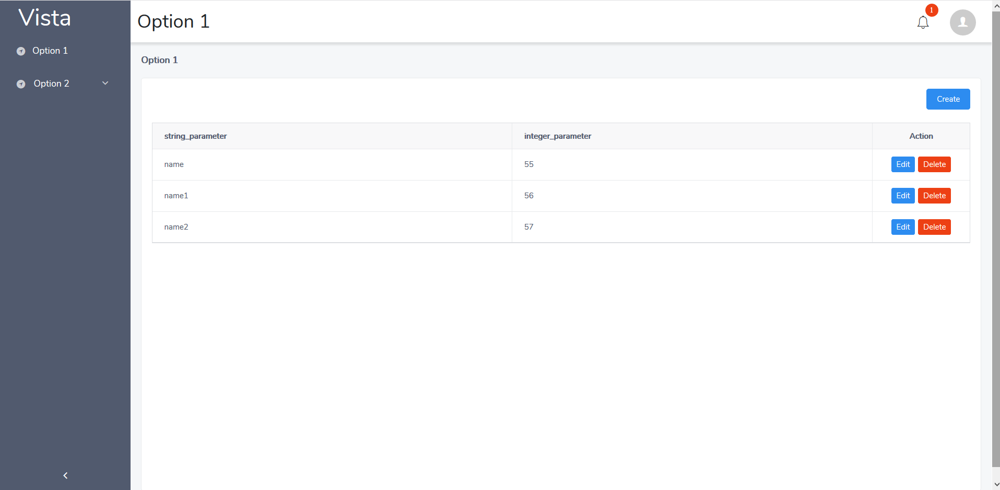
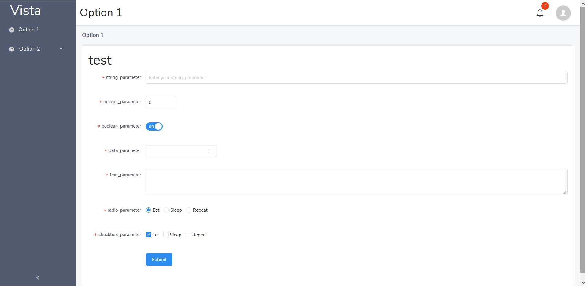

# vista
A laravel UI generator using iview, vue

# Introduction

The purpose of this package is to generate a web UI for a laravel application using laravel's models, migrations and validations (Form Request Validation).

The package generates a Single Page Application (SPA) and functionallity through custom artisan commands which generate code. It uses vue js and iview UI Toolkit as a foundation.

**video introduction at:** https://www.youtube.com/watch?v=4zuZATtU1GA

## Application architecture

### Preface

The main design principles behind the SPA architecture is to set a thin client structure which communicates with the server through restful API's. It wants to promote the notion that the front-end should be for presentation only, leaving the back-end to do the heavy lifting. This is the main reason for a simple routing and menu architecture. The code generators that are provided follow this simplicity. 

### Folder structure

The package on install creates among others the following folder structure

```
|* public_*
    |- css
    |- js
    |->.htaccess
    |->favicon.ico
    |->index.php
    |->robots.txt
|* resources_*
    |- js
        |- components
            |->BasicLayout.vue
        |- navigation
            |- main_menu
                |->main_menu.js
            |- sub_menus
                |->demo_sub_menus.js
        |- pages
            |->index.vue
        |- store
            |- components
                |->BasicLayout.js
            |- pages
                |->Index.js
        |- types
            |- schemas
            |->TypeChecker.js
            |->TypedComponentData.js
        |->app.js
        |->app.vue
        |->bootstrap.js
        |->router.js
        |->router.pages.js
        |->router.submenus.js
        |->store.js
    |- sass
    |- views
        |->iview.blade.php
```
Where `|* public_*` and `|* resources_*` are the SPA's directories in the root folder of a laravel application. Every component or page has it's dedicated storage. Vue component data can be type checked as can all other inputs, more details are seen in Strict Types section below.

This package supports multiple SPA's from one laravel instance. For example we could have a pair `|* public_front_end`, `|* resources_front_end` and `|* public_back_end`, `|* resources_back_end` that work in parallel with the same controllers, models, e.t.c. just by configuring webpack.mix.js accordingly. This is described in more detail at the installation section below.

The general workflow for adding a new page follows the following pattern:

- creating a vue component in the `pages` folder
- updating the `router.pages.js` with this new vue component
- updating the `router.js` with this new vue component
- updating the `main_menu.js` in order to have a visual route to the new page

The main layout of a SPA is presented in the image below

.png)

There are four menu levels split in main menu and sub menus. Main menu is at the left sidebar and is the same for every page, it can facilitate two levels. Sub menu's are defined in the router and presented above the content and can facilitate another two levels. There is also place for notifications and user account menus in the top right corner. 

As of now an automated CRUD functionallity is provided by code generation. It creates three pages (`*_create.vue`, `*_list_delete.vue`, `*_update.vue`) at the `pages` folder which correspond to viewing and deleting and creating, updating records to the database from a specific model. For every page it is assumed that there is a resource (restful CRUD from laravel) named with the prefix of every page (e.x. `user_create.vue` assumes that there is a resource named `user` at url `/trident/resource/user`) In the images below this functionallity is presented.

List/Delete:



Create/Update:




# installation

## to add to a laravel project as a package
add 
```json
"repositories": [
    {
        "type": "vcs",
        "url": "https://github.com/j0hnys/vista"
    }
],
```
and 
```json
"require-dev": {
    "j0hnys/vista": "dev-master"
},
```
to laravel's `composer.json` and then execute `composer update`

add
```json
"dependencies": {
    "view-design": "^4.0.0",
    "iview-loader": "*",
    "vue": "^2.5.16",
    "vuex": "^3.0.1",
    "vuex-persistedstate": "2.5.4",
    "vue-router": "^2.8.1",
    "hello-type": "2.24.5"
}
```
to laravel's `package.json` and then execute `npm install`


After publishing the configuration of this package (`php artisan vendor:publish`) the configuration can be found at `config/vista.php`. Below there is a snippet of that file

```php
<?php

return [

    /*
    |--------------------------------------------------------------------------
    | Single Page Application Paths
    |--------------------------------------------------------------------------
    */

    'spas' => [
        [
            'resource_folder_name' => 'resources_front_test',
            'public_folder_name' => 'public_front_test',
            'mix_base_url_env_name' => 'MIX_BASE_URL_FRONT_TEST',
            'mix_base_relative_url_env_name' => 'MIX_BASE_RELATIVE_URL_FRONT_TEST',
            'mix_storage_url_env_name' => 'MIX_STORAGE_URL_FRONT_TEST',
        ],
    ],

];
```

`MIX_BASE_*` are set in the `.env` file and follow the rules below
 - `MIX_BASE_URL_FRONT_TEST`: link to index.php in public folder,
 - `MIX_BASE_RELATIVE_URL_FRONT_TEST`: public uri if public link is in subfolder
 - `MIX_STORAGE_URL_FRONT_TEST`: public link to storage

e.x.
```
MIX_BASE_URL_TEST=http://localhost/laravel_test/public_front_test
MIX_BASE_RELATIVE_URL_TEST=/laravel_test/public_front_test
MIX_STORAGE_URL_TEST=http://localhost/laravel_test/public_front_test/storage/app
```

As said in the application architecture section more than one SPA's can be created

After setting the configuration file execute:
```
php artisan vista:install resources_front_test
```

to install the `resources_front_test` SPA.

Lastly the `webpack.mix.js` has to be modified in order to support more than one SPA's. A sample `webpack.mix.js` is provided below:
```js
const mix = require('laravel-mix');

/*
 |--------------------------------------------------------------------------
 | Mix Asset Management
 |--------------------------------------------------------------------------
 |
 | Mix provides a clean, fluent API for defining some Webpack build steps
 | for your Laravel application. By default, we are compiling the Sass
 | file for the application as well as bundling up all the JS files.
 |
 */

mix.setPublicPath(('../vista-framework/'));

mix.js('resources/js/app.js', 'public/js')
   .sass('resources/sass/app.scss', 'public/css');

mix.js('resources_front_test/js/app.js', 'public_front_test/js')
   .sass('resources_front_test/sass/app.scss', 'public_front_test/css');
```

where `vista-framework` is the name of the folder that laravel is installed.

# Available artisan commands

| Command | Description | Parameters
|---|---|---|
vista:export:model  | export a model's schema | {entity_name} {entity_namespace}
vista:generate:crud | Create a Spa CRUD       | {name} {--schema_path=} {--resources_relative_path_name=}
vista:install       | Vista installer         | {resources_relative_path_name?}

# Basic usage

## CRUD

First we need to retrive the data from the model in order to create the CRUD pages. 

First we need to export the data to a json file using the following artisan command
```
php artisan vista:export:model test_model
```

where `test_model` is the name of a laravel model located at `app` folder. After that we can edit the exported schema accordingly, like change the default generated endpoints

Than execute:
```
php artisan vista:generate:crud DemoPage --schema_path="/app/Models/Schemas/Exports/test_model.json" --resources_relative_path_name="resources_front_test"
```

where the first parameter is the prefix of the pages, the next parameter is the exported model and the last is the SPA that the pages are going to be placed.

After completing this process the following changes have taken place:

- A new set of pages will be created at `pages` folder (`DemoPage_list_delete.vue`, `DemoPage_list_delete.vue`, `DemoPage_update.vue`)  
- the `router.js` will be automatically updated with the routes for the new pages

It is noted once again that a resource named `DemoPage` should exist in laravel with url `/trident/resource/DemoPage`.

Menu placement is left to the developer. It is done by modifying `main_menu.js` or sub_menus accordingly.


## Strict Types

In order to make functionality more descriptive a type system have been implemented in the vue project. The main purpose is to define the structures of all data that run through the application, from function parameters to Vue component data. The concept has similarities to Data Tranfer Objects (DTO's) but the main mechanism that the structure is "forced" is through validation of the data to be examined. 

Let's say for example that we have the following definition (must be in `./types/schemas` folder):

```js
import HelloType, { Dict, Enum, Tuple, List, Type, Rule, Self, IfExists } from 'hello-type'

const PersonInfo = new Type({
    firstname: String,
    lastname: String
});


export default {
    namespace: 'test/test/test',
    assert(data) {
        PersonInfo.assert(data);
    },
};
```

we can use this definition to validate the vue components `data()` Object API property or in any other situation. An example component is shown below:

```vue
<template>
    <div>
        firstname: {{firstname}}
        lastname: {{lastname}}
    </div>
</template>

<script>
    import TypeChecker from '../types/TypeChecker.js';

    export default {
        data() {
            return {
                firstname: 'John',
                lastname: 'John',
            };
        },
        types: {
            namespace: 'test/test/test',
        },
        mounted() {

            TypeChecker.checkNamespace('test/test/test',{
                firstname: '1',
                lastname: 11,
            });

        },
    }
</script>
```

Using the `types` top level component property we can check that the `data()` follow the spec that is defined above. We can check this structure anywhere using the TypeChecker's `checkNamespace` function. In that way we can type check any function's paremeters. e.x. snippet
```js
methods: {
    someFunction(data) {
        TypeChecker.checkNamespace('test/test/test', data);
    },
}        
```

If the data that are passed to the type checker do not much the specification an error will be thrown describing the issue. For performance reasons all the type checks and definitions are excluded from the production build if we use exclusively type namespaces as demonstrated above.


## Global events

Vue has a custom events system in place, which for most cases is fine. There are scenarios when we would like to have more control on custom events, some of those scenarios are:
 
 - Emit and listen to events that are not part of the vue app. This is case is more common when integrating vue with existing front-end application
 - Organize event listeners in a more flexible way (remove event listening hook from the template, like when using `v-on`) which is more apparent when applications start to get bigger. 

For this reason a `$global_events` property has been implemented in the base Vue Object. Using global events we could register and fire events like in the snipper below:
```vue
<template>
    <div>
        <button @click="onButtonClicked"> CLICK ME </button>
    </div>
</template>

<script>
    export default {
        data() {
            return {
                firstname: 'John',
                lastname: 'John',
            };
        },
        methods: {
            onButtonClicked() {
                this.$global_events.$emit('pages/Index/test','emited string');
            },
        }
        mounted() {
            this.$global_events.$on('pages/Index/test',(data) => {
                console.log('pages/Index/test global event fired with data: "'+data+'"');    
            });
            

        },
    }
</script>
```

The added benefit here is that event naming can follow the **namespacing convention** that `vuex` follows 